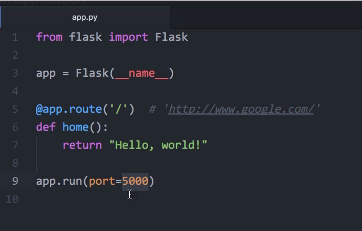
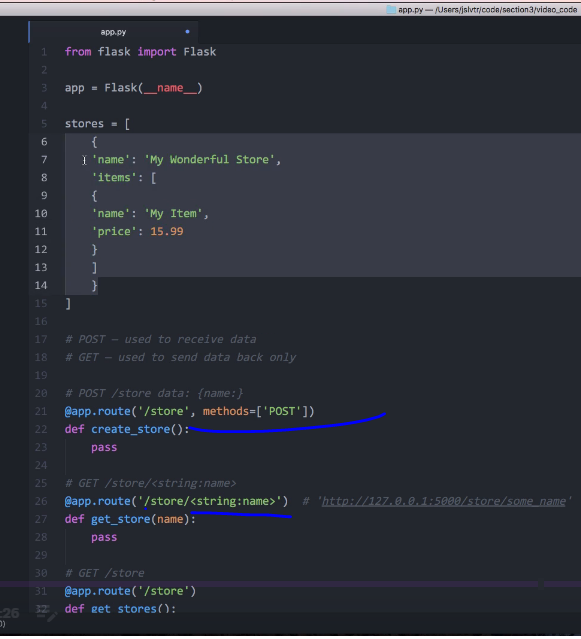
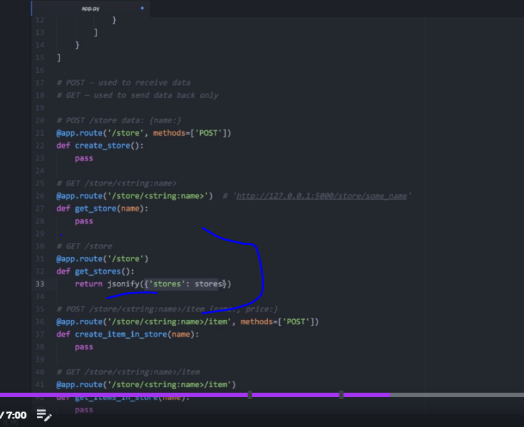
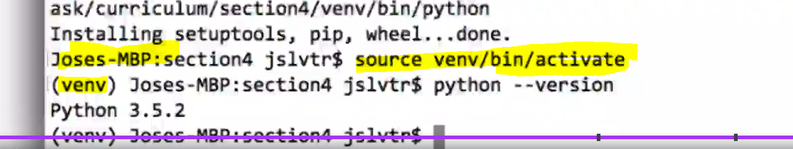
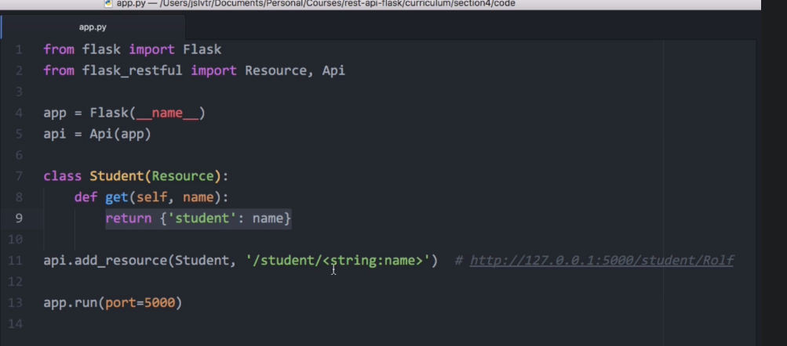
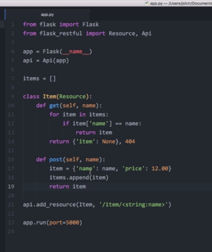
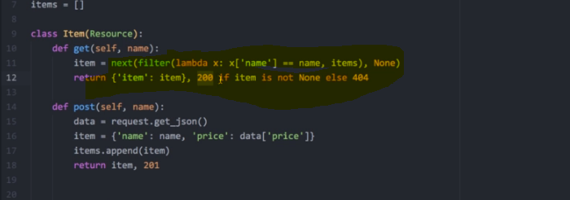
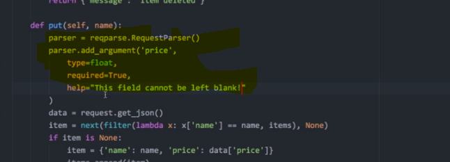

# Python

###  Go through code

### Work with REST:

pip: to install python library  
somtime we use brew  

```
pip3.5 install flask  
```



TO run:
```
python3.5 app.py
```




### Virtualenvs
It gives a clean installation of Python (with no lib i.e. we dont need to install python again)

```
pip3.5 freeze -> will gives libraries and its versions
```


```
install virtualenv
virtualenv venv --python=python3.5
```

THis will create a venv folder inside the project and will put python installation (here 3.5)
```
source venv/bin/activate -> mac
./venv/Scripts/activate.bat

Not istall FLASK for venv
pip install Flask-RESTful

deactivate -> to move out from venv
```



### Flask REST







### Flask-JWT Library:    
Add basic JWT features to your Flask application.
Similar like we have implemented JWT authprization in platform i.e. when we try to 
call BUSSR service we need to pass JWT

### Request Parsing (Using reqparse)




